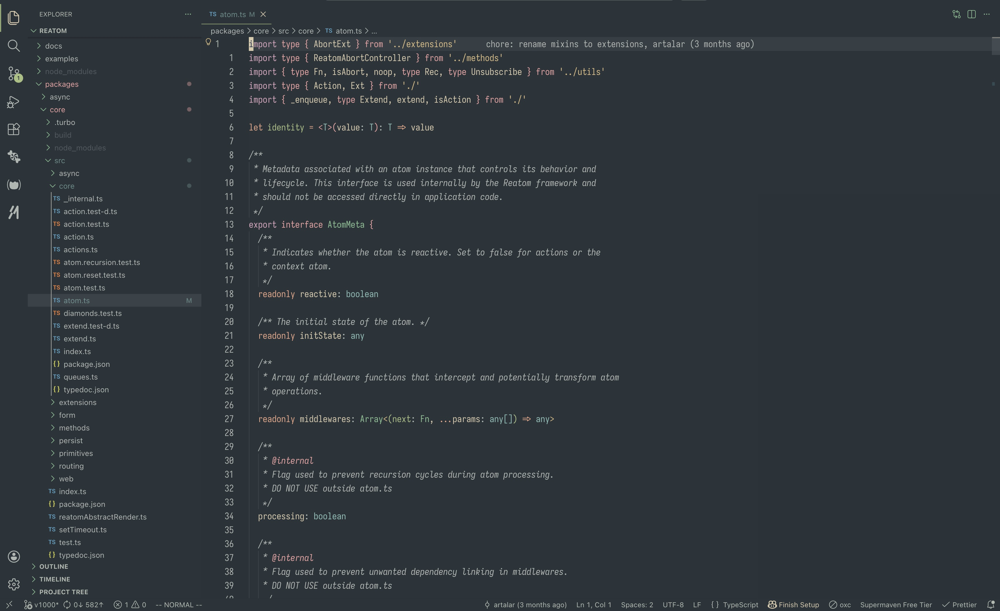
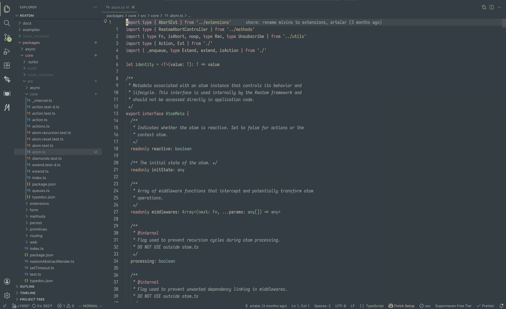
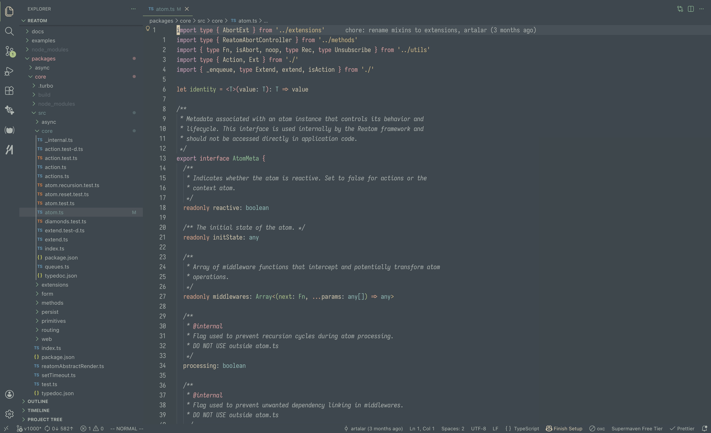

# 🌲 Forest Night

A green-based theme for Visual Studio Code, designed to stay warm and readable during long coding sessions

### Forest Night Hard



### Forest Night Medium



### Forest Night Soft



Supports both VS Code Desktop and VS Code for the Web.

## Installation

1. Open the Extensions sidebar (`Cmd+Shift+X` / `Ctrl+Shift+X`)
2. Search for **Forest Night**
3. Click **Install**
4. Open **Preferences: Color Theme**
5. Select one of the built-in variants:
   `Forest Night Medium`, `Forest Night Hard` or `Forest Night Soft`

## Theme Variants

| Variant                       | Main Background (`editor.background`) | Description                        |
| ----------------------------- | ------------------------------------- | ---------------------------------- |
| Forest Night Hard             | `#2a3339`                             | Highest contrast in the dark range |
| Forest Night Medium (default) | `#323d43`                             | Balanced default contrast          |
| Forest Night Soft             | `#3c474d`                             | Softest dark background            |

## Color Palette

### Main Colors

| Color      | Hex       | Preview                                                       |
| ---------- | --------- | ------------------------------------------------------------- |
| Background | `#323d43` |  |
| Foreground | `#d8caac` |  |
| Red        | `#eda0a1` |  |
| Orange     | `#e9a485` |  |
| Yellow     | `#dbbc7f` |  |
| Green      | `#a7c080` |  |
| Aqua       | `#83c092` |  |
| Blue       | `#86bfb7` |  |
| Purple     | `#dba5bf` |  |

### Background Contrast Variants

| Variant          | Hex       | Preview                                                       |
| ---------------- | --------- | ------------------------------------------------------------- |
| Hard             | `#2a3339` |  |
| Medium (default) | `#323d43` |  |
| Soft             | `#3c474d` |  |

## Customization

Forest Night supports real `forestNight.*` settings.
These settings are applied automatically for all three Forest Night variants in both VS Code Desktop and VS Code for the Web.

| Setting                                     | Values                                                     | Default    |
| ------------------------------------------- | ---------------------------------------------------------- | ---------- |
| `forestNight.contrast`                      | `theme`, `hard`, `medium`, `soft`                          | `theme`    |
| `forestNight.workbench`                     | `material`, `flat`, `high-contrast`                        | `material` |
| `forestNight.selection`                     | `grey`, `red`, `orange`, `yellow`, `green`, `aqua`, `blue`, `purple` | `grey`     |
| `forestNight.cursor`                        | `white`, `red`, `orange`, `yellow`, `green`, `aqua`, `blue`, `purple` | `white`    |
| `forestNight.diagnosticTextBackgroundOpacity` | `0%`, `12.5%`, `25%`, `37.5%`, `50%`                       | `0%`       |
| `forestNight.italicKeywords`                | `true`, `false`                                            | `false`    |
| `forestNight.italicComments`                | `true`, `false`                                            | `true`     |
| `forestNight.highContrast`                  | `true`, `false`                                            | `false`    |

`forestNight.contrast = "theme"` keeps each selected variant's native contrast (`Hard`, `Medium`, `Soft`).

### Extension settings example

```jsonc
{
  "workbench.colorTheme": "Forest Night Medium",
  "forestNight.contrast": "theme",
  "forestNight.workbench": "material",
  "forestNight.selection": "aqua",
  "forestNight.cursor": "green",
  "forestNight.diagnosticTextBackgroundOpacity": "25%",
  "forestNight.italicKeywords": true,
  "forestNight.italicComments": true,
  "forestNight.highContrast": false
}
```

### Optional manual overrides

You can still add extra VS Code overrides in `settings.json` using the theme name keys.
Prefer using `forestNight.*` for managed palette behavior and use manual overrides for additional tweaks.

```jsonc
{
  "workbench.colorTheme": "Forest Night Medium",
  "workbench.colorCustomizations": {
    "[Forest Night Medium]": {
      "editorGutter.background": "#323d43",
    },
    "[Forest Night Hard]": {
      "editorGutter.background": "#2a3339",
    },
    "[Forest Night Soft]": {
      "editorGutter.background": "#3c474d",
    },
  },
  "editor.tokenColorCustomizations": {
    "[Forest Night Medium]": {
      "comments": "#aeb6b0",
    },
  },
}
```

## Acknowledgments

Inspired by [Forest Night](https://github.com/jef/forest-night-jetbrains) by [@jef](https://github.com/jef) and [Everforest](https://github.com/sainnhe/everforest-vscode) by [@sainnhe](https://github.com/sainnhe)

## License

[MIT](LICENSE)
